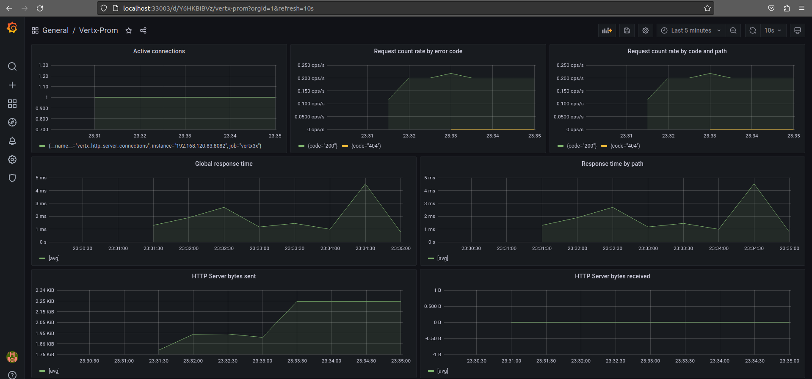
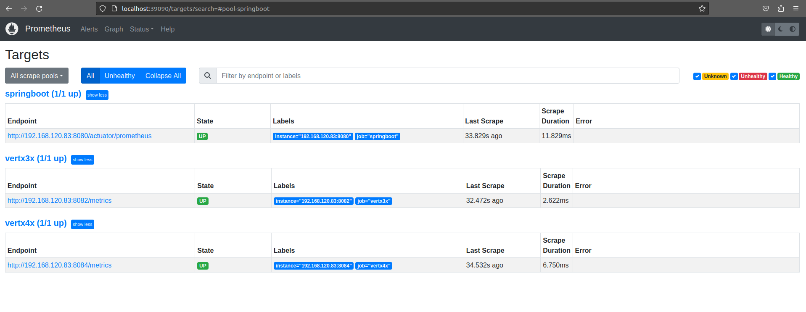
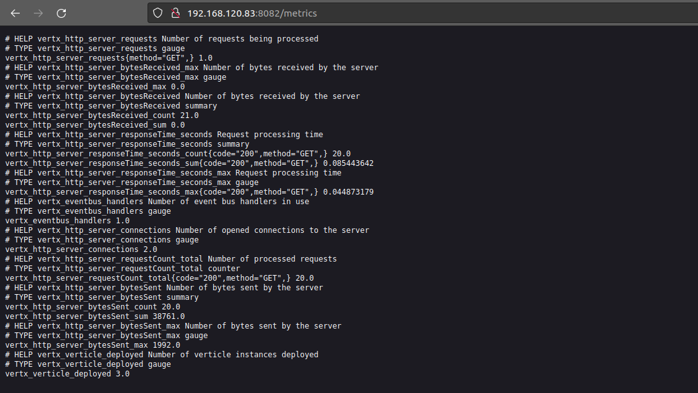

# vertx-grafana-prometheus-metrics

## Grafana

### Config
Default config at `configuration.env`
### Port
Default port: `33003` -> [Open at localhost](http://localhost:33003)


## Prometheus

### Config
./conf/prometheus.yml
### Port
Default port: `39090` -> [Open at localhost](http://localhost:39090/targets)


## Start apps

### springboot
Default port: `8080`.\
Change at `/src/main/resources/application.properties`.

### vert3x
Default port: `8082`.\
Change at `/config/app.json`.

### vert4x
Default port: `8084`.\
Change at `/config/app.json`.


## Start Granfana + Prometheus

### Requires
1. docker
2. docker-compose

### Run script
```sh
docker-compose up -d
```


## Images
### grafana_dashboard


### prometheus_targets


### vert3x_metrics
